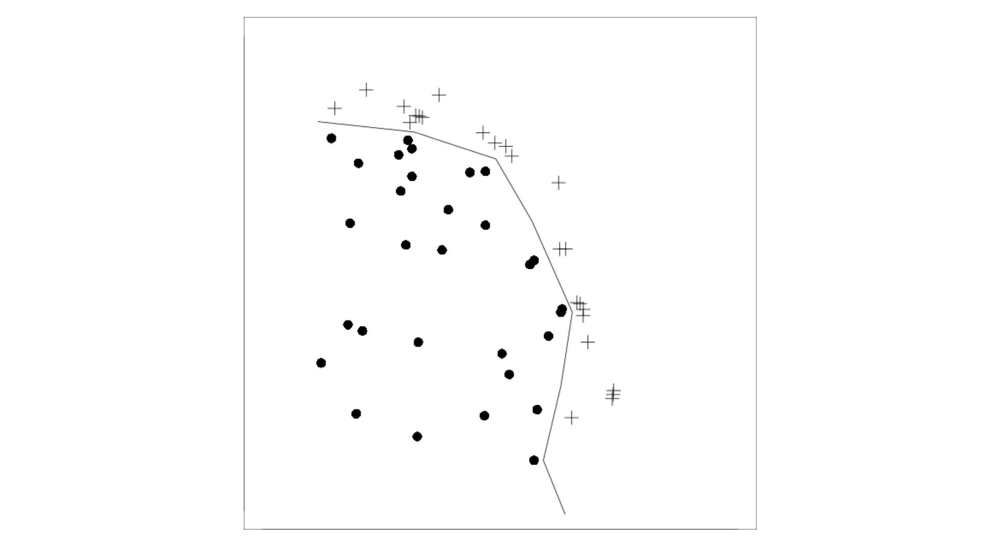

```{r setup, include=FALSE}
knitr::opts_chunk$set(messages = FALSE)
```

```{r, echo=FALSE}
library(tidyverse)
library(sf)
library(adehabitatHR)
library(move)
```

Today we are going to explore 2 of 3 main methods for home range estimation in R. Eric will touch on the 3rd - convex hull methods - on Tuesday. Today, we will again work primarily with the adehabitatHR library and the move library. Most of this code and text is an adaptation of the extensive adehabitatHR vignettes, which we encourage you to consult for further detail and references. 

# Minimum Convex Polygon 

As dicussed in lecture, the simplest delineation of a home range is an MCP, 
creating the polygon of minimum area around a certain percentage of relocation points. 
The MCP is simple and used widely in ecology. 

If you are curious to estimate the overall area of your animal's home range
the `move` package includes a function to bootstrap the mcp estimation:

```{r}
data(leroy) # a package moveobject
hrBootstrap(x=leroy, rep=25, unin='km', unout='km2')
```
The resulting table and plot can give you a fairly quick estimate of your animals stable home range. Note that this method works especially well for a territorial animal like a fisher, 
but might appear much less stable for a migratory or nomadic individual.

If, however, you need to delineate the boundaries of the MCP, the adehabitatHR library has more options for you. The `mcp` function allows you to specify the percentage of coordinates to be included and works on any two column dataframe specifying the coordinates of animal relocations:
```{r}
data(bear)
head(bear)
xy <- SpatialPoints(na.omit(ld(bear)[,1:2])) 
#ld  {adehabitatLT}: converts ltraj to a df. dl does the opposite
# na.omit: removes rows with NAs from columns "id" and "burst"
# SpatialPoints {sp}: creates objects of class "spatialpoints" (either sp-class or spdf-class) form coordinates

mcp <- mcp(xy, percent=90) #minimum convex polygon (outermost edges)

ggplot() + geom_sf(data = st_as_sf(mcp)) + geom_sf(data=st_as_sf(xy)) 
# st_as_sf {sf} converts foreign object to sf object 
```

Yikes! look at all that "unused" space contained within even a 90% mcp!

We'll get to better metrics shortly but if you want to compare the area of your mcp across percentages, the `mcp.area` function works well:
```{r}
mcp.area(xy, percent = seq(20,100, by = 5),
         unin = c("m", "km"),
         unout = c("ha", "km2", "m2"), plotit = TRUE)
```
 
If you are curious to see, what's going on under the hood of the adehabitatHR mcp functions, I recommend checking out [this blog post](https://www.r-bloggers.com/home-range-estimation-mcp) 
on the subject by Mitchell Gritts. 
         
# Kernel Density Estimation 

## Worton Kernel UD
The "classical" utilization distribution:  Worton (1995)

> The Utilization Distribution (UD) is the bivariate function giving the probability density that an animal is found at a point according to its geographical coordinates. Using this model, one can define the home range as the minimum area in which an animal has some specified probability of being located.


kernelUD {adehabitatHR}: estimates the utilization distribution of one or several animals. 
arguments:{xy} - object of SpatialPoints class, contains x and y relocations
          {h} - a character string or number. If h is set to "href", the ad hoc method is used for            the smoothing parameter (see details). If h is set to "LSCV", the least-square cross              validation method is used.
          *h = Sigman^(-1/6), where Sigma^2 = 0.5(var(x)+var(y))*
              h, the smoothing parameter, controls the width of the kernel functions placed over each relocation point. 

Estimate UD: 
```{r}
kud <- kernelUD(xy)  # get the UD
image(kud) + title("Bear UD")
class(kud)
```         
    
Estimate Home Range Size:          
```{r}
## Kernel home range
jj <- kernel.area(kud)   ## home range size
# kernel.area returns a data frame of subclass "hrsize", with one column per animal and one row per level of estimation of the home range.
head(jj)
class(jj) #numeric
plot(jj) ## Plots home range size
ver95 <- getverticeshr(kud) ## home-range contours 95% UD
ver80  <- getverticeshr(kud, percent = 80) #80% UD
plot(ver95)  + plot(ver80, add=TRUE, col="green")  +  points(xy)   ## Plots contours

```          
## Notes from {adehabitatHR} Vignette:        

We consider in this document the use of the package adehabitatHR to deal with home-range analysis. Implements multiple home range estimation methods...read all options in [adehabitatHR-vignette](https://cran.r-project.org/web/packages/adehabitatHR/vignettes/adehabitatHR.pdf)

### Math Background

*Inputs*: objects of the class SpatialPoints or SpatialPointsDataFrame (package sp)

*Kernel Estimation and the Utilization Distribution*:
We consider that the animals use of space can be described by a **bivariate probability density function**, the UD, which gives the probability density to relocate the animal at any place according to the coordinates (x, y) of this place. The *study of the space use* by an animal could consist in the *study of the properties of the utilization distribution*. The issue is therefore to estimate the utilization distribution from the relocation data.

The seminal paper of Worton (1989) proposed the use of the kernel method to estimate the UD using the relocation data. The basic principle of the method is the following: *a bivariate kernel function* is placed over each relocation, and the values of these functions are averaged together.

Many kernel functions K can be used in the estimation process provided that:

where x is a vector containing the coordinates of a point on the plane. There are two common choices for the kernel functions:
1. Bivariate Normal Kernel Function


2. The Epanechnikov kernel:

Then, the kernel estimation of the UD at a given point x of the plane is obtained by

where h is a smoothing parameter, n is the number of relocations, and Xi is the ith relocation of the sample. The smoothing parameter h controls the “width” of the kernel functions placed over each point. On an example dataset:

Lots of opinions on the correct choice for a smoothing parameter, but the two most common choices are the so-called “reference bandwidth”.
Bivariate normal kernel function's reference bandwidth:


and σx and σy are the standard deviations of the x and y coordinates of the relocations respectively. If an Epanechnikov kernel is used, this value is multiplied by 1.77 (Silverman, 1986, p. 86). The reference bandwidth supposes that the UD is a bivariate normal distribution, which is disputable in most ecological studies. When the animals uses several centers of activity, the reference smoothing parameter is often too large, which results into a strong oversmoothing of the data (the estimated UD predicts the frequent presence of the animal in areas which are not actually used).

Alternatively, the smoothing parameter h may be computed by Least Square Cross Validation (LSCV). The estimated value then minimizes the Mean Integrated Square Error (MISE), i.e. the difference in volume between the true UD and the estimated UD.

The function `kernelUD` {adehabitatHR} implements the method described above to estimate the UD. The UD is estimated in each pixel of a grid superposed to the relocations. The UD gives the probability density to relocate the animal at a given place. The home range deduced from the UD as the minimum area on which the probability to relocate the animal is equal to a specified value.For example, the 95% home range corresponds to the smallest area on which the probability to relocate the animal is equal to 0.95.

**From Wiki**:
Kernel density estimation (KDE) is a non-parametric way to estimate the probability density function of a random variable. Kernel density estimation is a fundamental data smoothing problem where inferences about the population are made, based on a finite data sample. 

Independent and identically distributed samples are drawn from some univariate distribution with an unknown density ƒ at any given point x. We are interested in estimating the shape of this function ƒ. The kernel is a non-negative function. Kernel density estimates are closely related to histograms, but can be endowed with properties such as smoothness or continuity by using a suitable kernel.

###  Estimating Utilization Distribution: Vignette Example 

```{r}
data(puechabonsp) #SpatialPixelsDataFrame
kud <- kernelUD(puechabonsp$relocs[,1], h="href")
kud
image(kud)
```

The values of the smoothing parameters are stored in the slot "h" of each element of the list. For example, to get the h-value for the first animal:
```{r}
kud[[1]]@h
```

Alternatively, could do least square cross validation. The LSCV algorithm searches for the optimum value of h in the interval specified by the parameter *hlim*.
```{r}
kudl <- kernelUD(puechabonsp$relocs[,1], h="LSCV")
image(kudl)
```
The resulting UD fits the data more closely than the use of “href”. However, note that the cross-validation criterion cannot be minimized in some cases. According to Seaman and Powell(1998) "This is a difficult problem that has not been worked out by statistical theoreticians, so no definitive response is available at this time”. Therefore, it is essential to look at the results of the LSCV minimization using the function plotLSCV:

```{r}
plotLSCV(kudl)
```
Here, the minimization has been achieved in the specified interval.When the algorithm does not converge toward a solution, the estimate should not be used in further analysis.

### Estimating Home range from UD: Vignette Example

**Home ranges in vector mode**

The most useful function is the function `getverticeshr`. For example, to deduce the 90% home range from the UD estimated using the LSCV algorithm:

```{r}
#deduce the 90% home range from the UD estimated using the LSCV algorithm:
homerange <- getverticeshr(kudl)
class(homerange)
```

The resulting object is of the class *SpatialPolygonsDataFrame.* Therefore, as for the MCP the functions of the package sp and maptools are available to deal with this object, or to export it toward a GIS.Therefore, to display the home range:

```{r}
plot(homerange, col = 1:4)
```

**Home ranges in raster mode**

gThe function `getverticeshr` returns an object of class *SpatialPolygonsDataFrame*, i.e. an object in mode vector.

The function `getvolumeUD` may also be useful to estimate the home range in raster mode, from the UD. Actually, this function *modifies the UD component of the object* passed as argument, so that the value of a pixel is equal to the percentage of the smallest home range containing this pixel.

```{r}
(vud <- getvolumeUD(kudl))
```

**To make clear the differences** between the output of `kernelUD` and `getvolumeUD` look at the values on the following contourplot:

```{r}
# run this chunk all at once because the code layers upon each plot. If run line by line, the code throws errors
## Set up graphical parameters
par(mfrow=c(2,1))
par(mar=c(0,0,2,0))
image(kudl[[1]]) # The output of kernelUD for the first animal
title("Output of kernelUD")
xyz <- as.image.SpatialGridDataFrame(kudl[[1]]) # Convert into a suitable data structure for the use of contour
contour(xyz, add=TRUE)
## and similarly for the output of getvolumeUD
par(mar=c(0,0,2,0))
image(vud[[1]])
title("Output of getvolumeUD")
xyzv <- as.image.SpatialGridDataFrame(vud[[1]])
contour(xyzv, add=TRUE)
```
Whereas the output of `kernelUD` is the *raw UD*, the output of `getvolumeUD` can be used to compute the home range (the labels of the contour lines correspond to the home ranges computed with various probability levels). For example, to get the rasterized 95% home range of the first animal:

```{r}
# store the volume under the UD (as computed by getvolumeUD) of the first animal in fud
fud <- vud[[1]]
# store the value of the volume under UD in a vector hr95
hr95 <- as.data.frame(fud)[,1]
# if hr95 is <= 95 then the pixel belongs to the home range
hr95 <- as.numeric(hr95 <= 95) #(takes the value 1, 0 otherwise)
hr95 <- data.frame(hr95) # Converts into a data frame
coordinates(hr95) <- coordinates(vud[[1]]) # Converts to a SpatialPixelsDataFrame
gridded(hr95) <- TRUE
image(hr95)# display the results
```
### Home Range Size

The *SpatialPolygonsDataFrame* returned by the function `getverticeshr` contains a column named “area”, which contains the area of the home ranges:

```{r}
as.data.frame(homerange)
```
The units of these areas are controlled by the parameters *unin* and *unout* of the function `getverticeshr`

There's also a function that computes the home-range size for several probability levels: `kernel.area`, which takes the UD as argument.

```{r}
(ka <- kernel.area(kudl, percent=seq(50, 95, by=5)))
```
The resulting object is of the class *hrsize*, and can be plotted using the function `plot`.  Note that the home-range sizes returned by this function are slightly different from the home-range size stored in the *SpatialPolygonsDataFrame* returned by the function `getverticeshr.`Indeed, while the former (`kernel.area`) measures the area covered by the rasterized home range (area covered by the set of pixels of the grid included in the home range), the latter (`getverticeshr`) measures the area of the vector home range (with smoother contour). However, note that the difference between the two estimates decrease as the resolution of the grid becomes finer.

```{r}
plot(ka)
```
### Physical Boundary Over Study Area 

Benhamou and Cornelis (2010) proposed an interesting approach to take into account the presence of physical boundaries on the study area. They proposed to extend a method developed for one dimension by Silverman 1986 to 2 dimensions. 

On this figure, the relocations are in the bottom left (filled in dots).The line describes a physical boundary located on the study area (e.g. a cliff, a pond, etc.).The animal cannot cross the boundary. The use of the classical kernel estimation will not take into account this boundary when estimating the UD. A classical approach when such problem occur is to use the classical kernel approach and then to set to 0 the value of the UD on the other side of the boundary.However, this may lead to some bias in the estimation of the UD near the boundary (as the kernel estimation will “smooth” the use across the boundary, whereas one side of the boundary is used and the other unused). 

Benhamou and Cornelis (2010) extended an approach developed for kernel estimation in one dimension: this approach consists in calculating the mirror image of the points located near the boundary, and adding these “mirror points” to the actual relocations before the kernel estimation (the crosses in the figure). 

**Note that this approach cannot be used for all boundaries.** There are two constraints that have to be satisfied: 
1. The boundary should be defined as the union of several segments, and each segment length should at least be equal to 3 × h, where h is the smoothing parameter used for kernel smoothing.

2. The angle between two successive line segments should be greater that π/2 or lower than −π/2.

Consider the case of the wild boar monitored in Puechabon.
```{r}
#Map of the elevation on the study area
image(puechabonsp$map)
```
This area is traversed by the Herault gorges. As can be seen on this figure, the slopes of the gorges are very steep, and it is nearly impossible for the wild boars monitored to cross the river. Using the function `locator()`, we have defined the following boundary:
```{r}
 bound <- structure(list(x = c(701751.385381925, 701019.24105475, 700739.303517889, 700071.760160759, 699522.651915378, 698887.40904327, 698510.570051342, 698262.932999504, 697843.026694212, 698058.363261028),
                         y = c(3161824.03387414, 3161824.03387414, 3161446.96718494, 3161770.16720425, 3161479.28718687,3161231.50050539, 3161037.5804938, 3160294.22044937, 3159389.26039528, 3157482.3802813)), 
                    .Names = c("x", "y"))

image(puechabonsp$map)
lines(bound, lwd=3)
```
We now convert this boundary (called *bound* here) as a SpatialLines object:
```{r}
bound <- do.call("cbind",bound)
Slo1 <- Line(bound)
Sli1 <- Lines(list(Slo1), ID="frontier1")
barrier <- SpatialLines(list(Sli1))
```

We can now set the parameter *boundary* of the function `kernelUD`, which indicates that we want to use this approach:
```{r}
kud <- kernelUD(puechabonsp$relocs[,1], h=100, grid=100, boundary=barrier)
image(kud)
```
The effect of the boundary correction is clear on the UD of Brock and Calou.

### Brownian Bridge: Time Dependence b/w Relocation

Bullard (1999) proposed an extension of the kernel method taking into account the time dependence between successive relocations. Whereas the *classical kernel method* places a kernel function above each *relocation*, the **Brownian bridge kernel** method places a kernel function above each **step** of the trajectory. This kernel function is a combination of two bivariate normal pdf (two “bumps”) and a Brownian bridge pdf. This method takes into account not only the position of the relocations, but also the path traveled by the animal between successive relocations. The following figure may help to understand the method:

In this example, the relocations are located into three patches. However, the order of use of the patches is not random. Using the Brownian bridge method allows to identify that some areas between the patches are actually not used by the animal.

The kernel Brownian bridge method is implemented in the function `kernelbb.` Two smoothing parameters need to be set:
1. *sig1*: This parameter controls the width of the “bridge” connecting successive relocations.The larger it is and the larger the bridge is. This parameter is therefore *related to the speed* of the animal. Careful! It isn't the speed though. Horne et al. (2007) call *sig1* the “Brownian motion variance parameter”. It is even not the variance of the position, but a parameter used to compute the variance (which is itself related to the speed). The variance of the position of the animal between two relocations at time t is S^2 = sig1*2 × t × (T − t)/T where T is the duration of the trajectory between the two relocations and t the time at the current position. Therefore sig1 is related to speed in a complex and biologically murky way. Can define *sig1* visually or using the function `liker` that implements the maximum likelihood approach developed by Horne et al. (2007).

2. *sig2*: This parameter controls the width of the “bumps” added over the relocations (see Bullard, 1999; Horne et al. 2007). Similar to the smoothing parameter h of the classical kernel method, and is therefore related to the imprecision of the relocations.

Use the function `kernelbb` for the Brownian Bridge Kernel Method. Input: object of *ltraj* class
```{r}
data(puechcirc)
x <- puechcirc[1]
x
plot(x)
```
A study has shown that the mean standard deviation of the relocations is equal to 58 meters on these data (Maillard, 1996, p. 63). Therefore, we set sig2 = 58 metres. Then we use the function `liker` to find the maximum likelihood estimation of the parameter sig1. We search the optimum value in the range [10, 100]:
```{r}
lik <- liker(x, sig2 = 58, rangesig1 = c(10,100))
```
There is no optimized value here. We expected a too large standard deviation... Let us try again, and search in the interval [1, 10]:
```{r}
lik2 <- liker(x, sig2 = 58, rangesig1 = c(1, 10))
lik2
```
The optimum value is 6.23.

```{r}
tata <- kernelbb(x, sig1 = 6.23, sig2 = 58, grid = 50)
tata
```
The result is an object of class *estUD*. 

utilization distribution and the 95% home range:
```{r}
image(tata)
plot(getverticeshr(tata, 95), add=TRUE, lwd=2)
```


# Additional Resources/Methods:
The above is only one of the many methods adehabitatHR library contains to calculate home ranges, 
complete list below: 

1. The Minimum Convex Polygon (Mohr, 1947)

2. Several kernel home range methods:
  - The “classical” kernel method (Worton, 1989)
  - the Brownian bridge kernel method (Bullard, 1999, Horne et al.
2007)  **the only temporal kernel method included in adehabitatHR**
  - The Biased random bridge kernel method, also called “movementbased
kernel estimation” (Benhamou and Cornelis, 2010, Benhamou,
2011)
  - the product kernel algorithm (Keating and Cherry, 2009).
  
3. Several home-range estimation methods relying on the calculation of convex
hulls:
  - The modification by Kenward et al. (2001) of the single-linkage clustering
algorithm
  - The three LoCoH (Local Convex Hull) methods developed by Getz
et al. (2007)
  - The characteristic hull method of Downs and Horner (2009)

## Temporal Kernel Methods
- Autocorrelated Kernel Density Estimation https://cran.r-project.org/web/packages/ctmm/vignettes/akde.html

